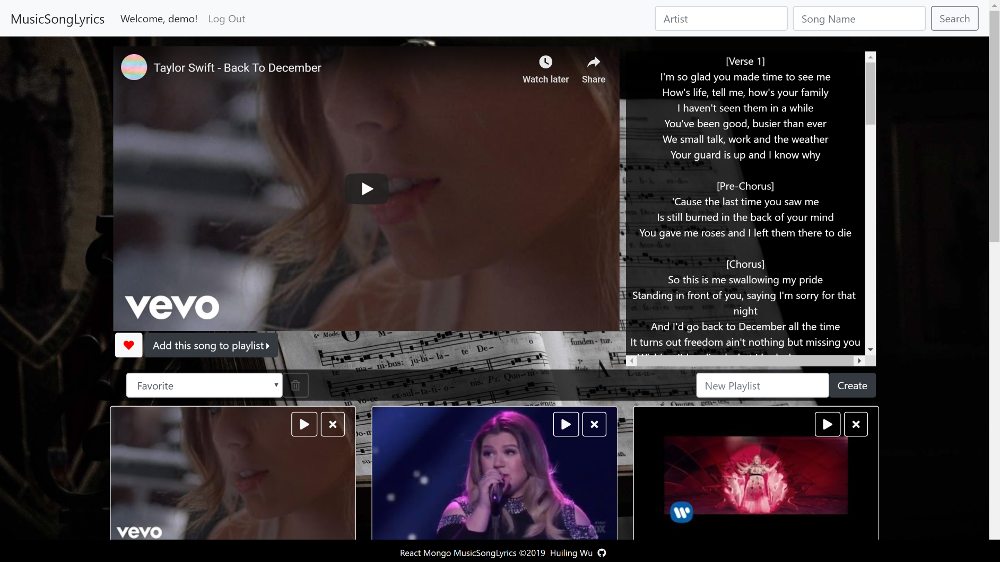
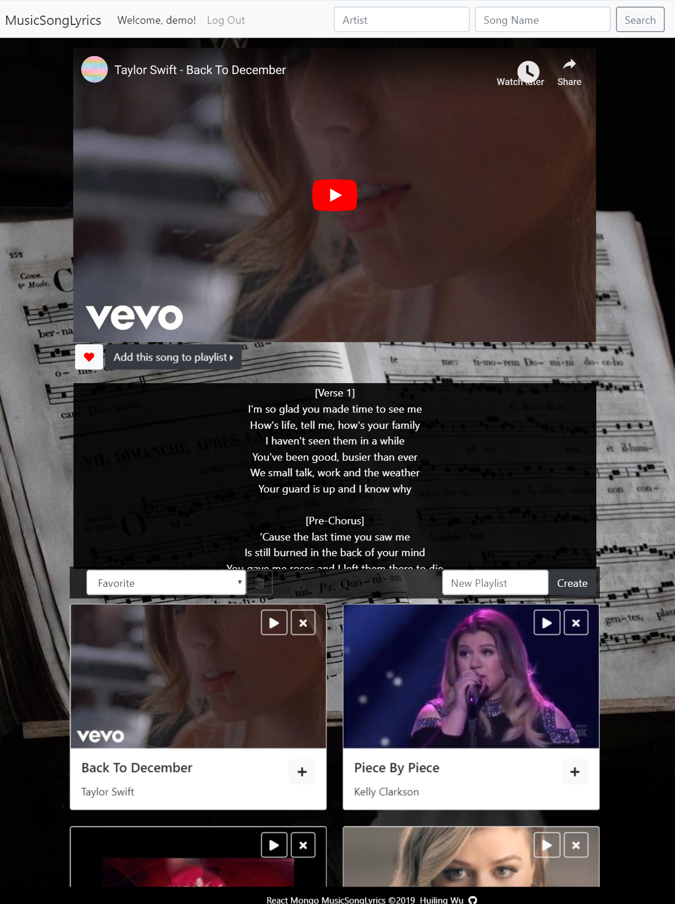
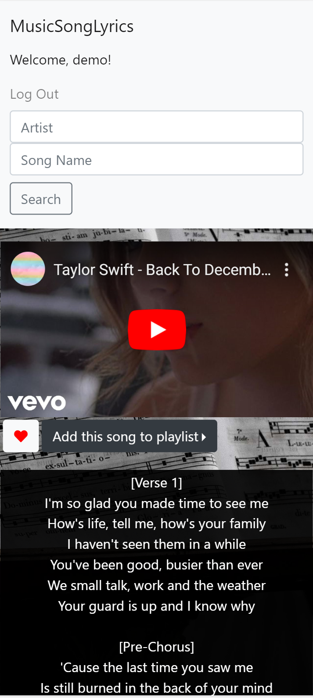
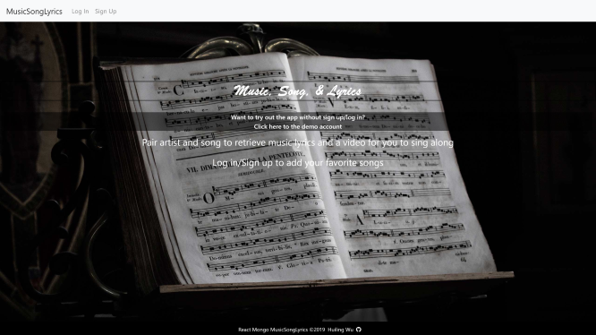
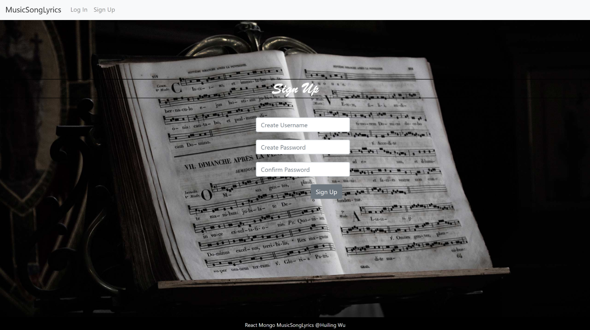
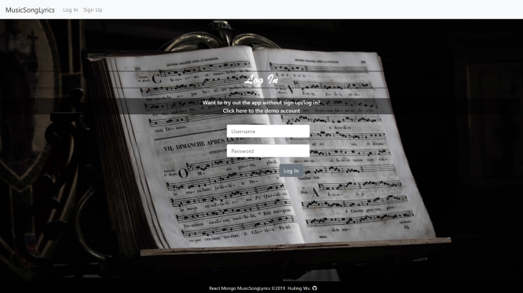
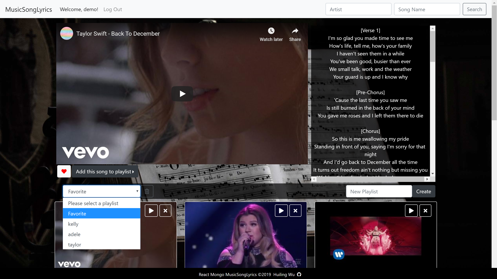
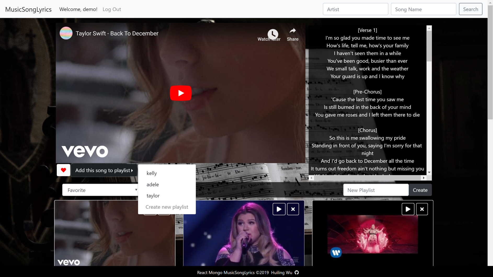
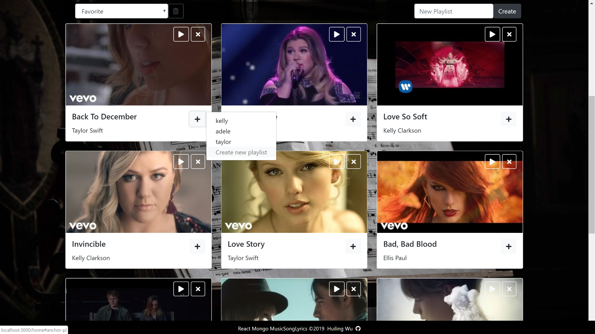

# React-Mongo-MusicSongLyrics

For users to search songs, enjoy watching music videos, and sing along with lyrics. This is a single page application that uses react-router-dom to navigate, hide and show React components without changing routes within Express. Users are be able to sign up and log in, and manage songs by adding them to Favorites or to created playlists.

|Laptop | Ipad | Phone |
|--- | --- | --- |
| |  |  |

## Getting Started
These instructions will get you a copy of the project up and running on your local machine for development and testing purposes.
* Install [nodejs](https://nodejs.org/en/) for backend server.
* Install [MongoDB](https://www.mongodb.com/) for database. 
* Get API keys from 
    * [YouTube](https://developers.google.com/youtube/v3/) to search for music videos
    * [Apiseeds](https://apiseeds.com/documentation/lyrics) to search for lyrics

After finish setting up the above, clone this project to your local machine and we can go to the next step.

### Installing
`cd React-Mongo-MusicSongLyrics` and run the command below to install everything for the server.
```
npm install
```
Then run the command below to change directory to client and install React project for front end.
```
install
```

## Built With 
* React v16.8.4
* Node Fetch v2.6.0
* bcryptjs v2.4.3
* express v4.16.4
* Json Web token  v8.5.0
* Mongoose v5.4.18
* MongoDB v4.0.5

### Database Set Up
Use Mongodb, and Mongoose to access database
* User schema
    * name - user name, must be unique
    * password_hash - password length must greater than 5, use `bcrypt` to generate hash
    * favorites - collection of songs from Song as reference 
    * playlists - collection of playlists from Playlist as reference
* Playlist schema
    * name - playlist name
    * songs - collection of songs from Song as reference
* Song schema
    * name - song name
    * artist - artist name
    * thumbnail - thumbnail picture url
    * video - YouTube video url
    * lyrics

The database grows as more users sign up, playlists get created, and songs get searched and added.

### Running the tests
To run a local testing server, go to the root directory of this project and run this command in your terminal:
```
node server
```
Now the local server is running on port 3001 in your local machine.

`cd client` to React project directory and run this in your terminal:
```
yarn start
```
React is running on port 3000. Open your browser and visit http://localhost:3000.

## Features
* This is a single page application that uses `react-router-dom` to navigate, hide and show React components without changing routes within Express.
* Users have to sign up to create accounts in order to log in and search songs and lyrics.
* Create jwt token and stored in local storage when users log in.

| Welcome | Sign Up | Log In |
| --- | --- | --- |
|  |  |  |

After user logs in 
* Client side:
    * user is able to search songs and lyrics by pairing artist and song names
    * add current song to Favorite or existing playlists
    * select playlist to see collections
    * create new playlists
    * manage songs in Favorite by adding songs to other playlists or deleting songs.
* Server side:
    * verify jwt token and decode token to get username as middleware 
    * interact with database based on requests made
        * add song to Favorite, remove song from Favorite
        * create new playlist, delete existing playlist
        * add song to existing playlist, remove song from existing playlist

| Create/Select playlist | Add song to playlist | Manage songs in Favorites |
| --- | --- | --- |
|  |  |  |

* when user logs out, jwt token that stored in local storage destroys.

<p align="center">
  
</p>

## Deployed to Heroku
Check out this project here: https://react-mongo-musicsonglyrics.herokuapp.com/

## Meta

Huiling Wu 
* huwu@ucdavis.edu
* https://github.com/huwu55
* https://www.linkedin.com/in/huwu55/

## Acknowledgments

This project has an old version which it doesn't have a server and uses Firebase to store data. 
Check out the old version here: https://github.com/huwu55/MusicSongLyrics.