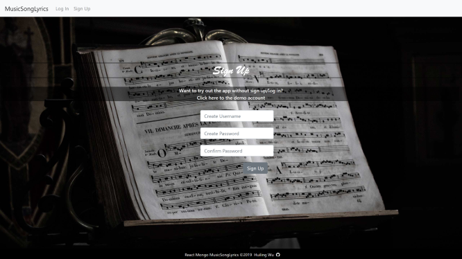

# React-Mongo-MusicSongLyrics

Using Node Express to host For users to search songs, enjoy watching music videos, and sing along with lyrics. Users are be able to sign up and log in using their usernames and passwords. Users can manage their songs by adding/deleting songs to/from Favorites. Users can create and manage playlists as well.


## Getting Started
These instructions will get you a copy of the project up and running on your local machine for development and testing purposes. First of all, you have to install [nodejs](https://nodejs.org/en/) for backend server and [MongoDB](https://www.mongodb.com/) for database on your local machine. 

### Installing
`cd React-Mongo-MusicSongLyrics` and run the command below to install everything for the server.
```
npm install
```
Then run the command below to change directory to client and install React project for front end.
```
install
```

### Running the tests
To run a local testing server, go to the root directory of this project and run this command in your terminal:
```
node server
```
Now the local server is running on port 3001 in your local machine.

`cd client` to React project directory and run this in your terminal:
```
yarn start
```
React is running on port 3000. Open your browser and visit http://localhost:3000.

### Usage Example
<p align="center">
  
</p>

<p align="center">
  
</p>

<p align="center">
  
</p>

<p align="center">
  
</p>

<p align="center">
  
</p>

<p align="center">
  
</p>

<p align="center">
  
</p>
<!-- 


 -->